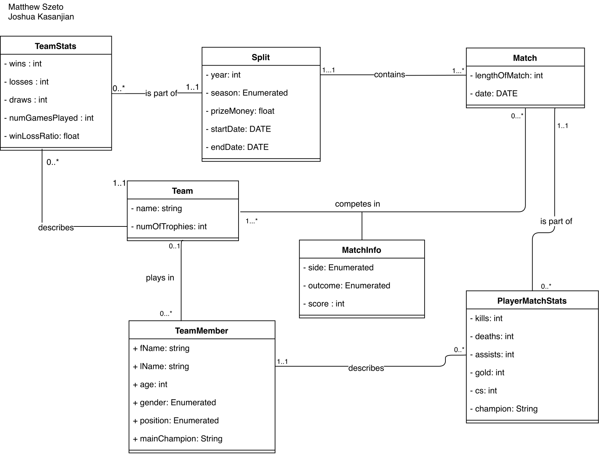
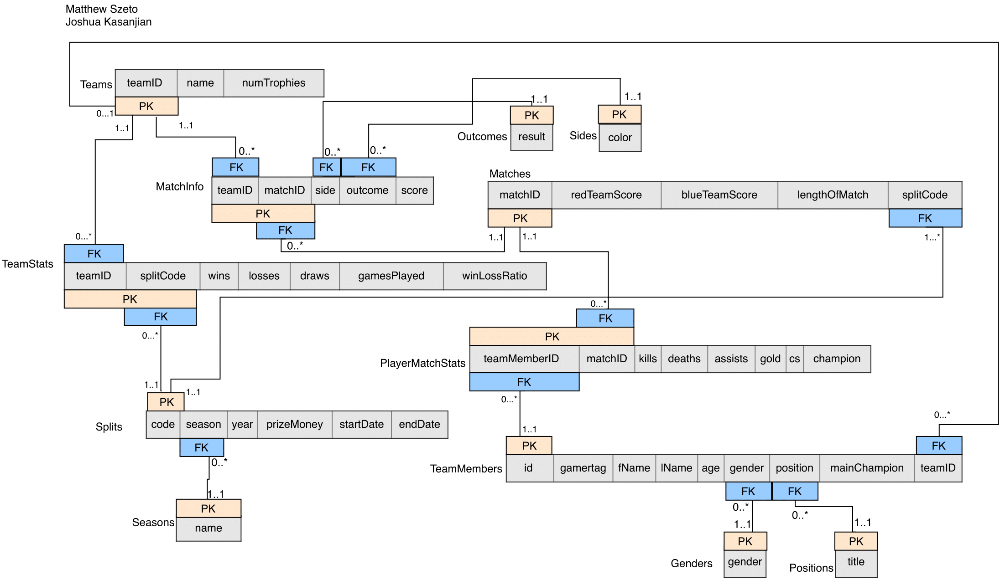

# Esports-JPA-Database

This was a group project for my Database Fundamentals class where I collaborated with a partner, Matthew Szeto 
to create a realational database (MySQL) and application using the Java JPA Framework.

The purpose of the database is to store information for an eSports Tournament for the popular multiplayer game, League of Legends. 
This database can showcase statistics of each player’s performance as well as each team’s performances during matches. We designed
the classes and relationships between the classes, as can be seen in the UML diagram. We also created a relational scheme to show
the keys that were used, and implemented the classes in Java using JPA annotations. The application allows the user to run queries, add
to the database, or remove from the database.

## UML Class Diagram:

## Relational Scheme:

